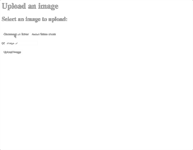

# Upload image files Node, Express and Multer.js

This example allows for uploading a file by:
- selecting a file on your machine
- entering a URL
- saving to an uploads folder on your server
- renaming the file with a datestamp
- limits file size to 1.5 MB (can be changed)

##TODO
- validation of non-conform files
	- currently allows uploading any kind of file

## Start
Type these commands in the terminal inside the folder where you cloned the repository
- `npm install` to install node modules
- `nodemon` if not installed `npm install nodemon -g`
- `open http://localhost:3000/`

## Resources
- https://github.com/expressjs/multer

---

# อัปโหลดไฟล์ภาพโหนด, Express และ Multer.js

ตัวอย่างนี้อนุญาตให้อัพโหลดไฟล์โดย:
- การเลือกไฟล์ในเครื่องของคุณ
- ป้อน URL
- บันทึกลงในโฟลเดอร์อัพโหลดบนเซิร์ฟเวอร์ของคุณ
- การเปลี่ยนชื่อไฟล์ด้วย datestamp
- จำกัด ขนาดไฟล์ไว้ที่ 1.5 MB (สามารถเปลี่ยนแปลงได้)

##สิ่งที่ต้องทำ
- การตรวจสอบไฟล์ที่ไม่สอดคล้อง
- ปัจจุบันอนุญาตให้อัปโหลดไฟล์ประเภทใดก็ได้

##อ้างอิง
- https://github.com/expressjs/multer

## เริ่ม
พิมพ์คำสั่งเหล่านี้ในเทอร์มินัลภายในโฟลเดอร์ที่คุณโคลนที่เก็บ
- `npm install` เพื่อติดตั้งโมดูลโหนด
- 'nodemon` ถ้าไม่ได้ติดตั้ง `npm install nodemon -g'
- `เปิด http://localhost:3000/

---

